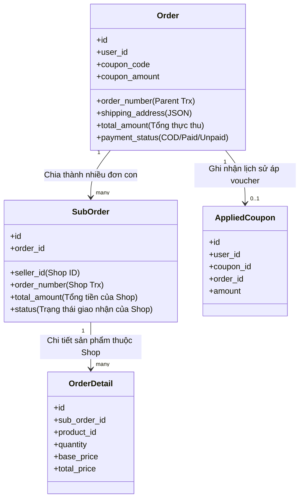
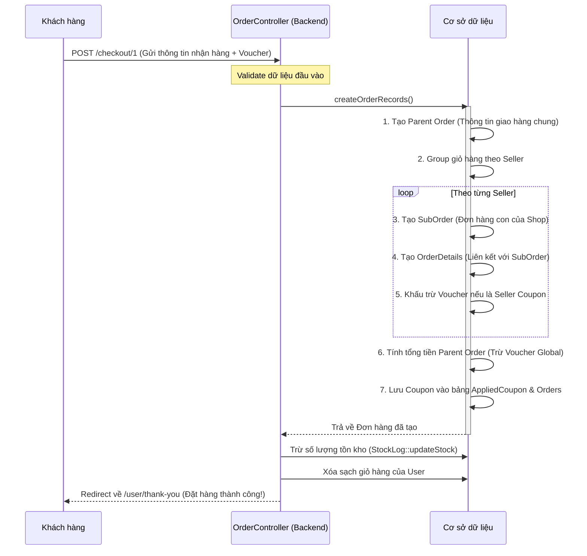

# KIẾN TRÚC LUỒNG CHECKOUT & ĐƠN HÀNG TRONG HỆ THỐNG MULTI-VENDOR

Tài liệu này phân tích chi tiết cách hệ thống quản lý đơn hàng Multi-vendor hoạt động, vai trò của từng bảng dữ liệu, và cách xử lý mã giảm giá (Coupon/Voucher) toàn sàn cũng như theo từng Shop.

---

## 1. Bản đồ Kiến trúc Đơn hàng (Database Schema Relations)

Hệ thống quản lý đơn hàng được thiết kế theo mô hình **Parent - Child** để hỗ trợ mua hàng từ nhiều Seller (Shop) khác nhau trong cùng một lần thanh toán:

---

## 2. Vai trò nhiệm vụ của từng bảng dữ liệu

### 2.1. Bảng `orders` (Đơn hàng chính / Parent Order)
* **Bản chất:** Là đơn hàng "bao trùm" đại diện cho toàn bộ phiên Checkout của khách hàng.
* **Nhiệm vụ:**
  - **Thông tin giao hàng tập trung:** Lưu trữ thông tin địa chỉ nhận hàng (`shipping_address` dạng JSON bao gồm Họ tên, SĐT, Tỉnh/Thành, Quận/Huyện, Địa chỉ cụ thể) của người mua. Khách hàng chỉ cần nhập thông tin này một lần duy nhất tại trang Checkout.
  - **Thanh toán tập trung:** Lưu trữ trạng thái thanh toán tổng thể (`payment_status`). Khi khách thanh toán Online (qua cổng PayOS, Momo), họ chỉ cần **thanh toán 1 lần duy nhất** cho toàn bộ Đơn hàng chính này.
  - **Tổng tiền thực tế:** Lưu tổng số tiền thực tế khách hàng phải trả (`total_amount` = Tổng tiền tất cả sản phẩm + phí ship - Voucher giảm giá).
  - **Áp dụng Voucher:** Lưu trực tiếp mã voucher (`coupon_code`) và số tiền được giảm (`coupon_amount`).

### 2.2. Bảng `sub_orders` (Đơn hàng con theo từng Shop / Child Order)
* **Bản chất:** Đây mới thực sự là đơn hàng phục vụ cho từng Seller/Shop cụ thể.
* **Nhiệm vụ:**
  - **Phân tách theo Shop:** Mỗi một Shop có sản phẩm nằm trong giỏ hàng sẽ nhận được một bản ghi `sub_orders` riêng (định danh bằng `seller_id`).
  - **Vận hành độc lập:** Trạng thái giao nhận (`status` như Chờ xác nhận, Đang xử lý, Đang giao, Đã hủy...) được quản lý riêng bởi từng Seller. Ví dụ: Khách mua sản phẩm của Shop A và Shop B, Shop A có thể giao hàng thành công, trong khi Shop B có thể hết hàng và hủy đơn con đó mà không ảnh hưởng đến đơn con của Shop A.
  - **Đối soát tài chính (Payout):** Lưu vết trạng thái thanh toán tiền bán hàng cho Seller (`is_payout`, `payout_at`) sau khi đơn hàng con hoàn tất.

### 2.3. Bảng `order_details` (Chi tiết sản phẩm)
* **Bản chất:** Chứa thông tin chi tiết của từng sản phẩm trong đơn hàng.
* **Nhiệm vụ:**
  - Được liên kết trực tiếp tới đơn hàng con (`sub_order_id`) thay vì đơn hàng chính.
  - Lưu trữ số lượng (`quantity`), giá bán (`base_price`), tổng tiền (`total_price`) và các biến thể/thuộc tính sản phẩm được chọn (`product_attributes`, `details`).

### 2.4. Bảng `applied_coupons` (Lịch sử sử dụng Coupon)
* **Bản chất:** Bảng lưu vết lịch sử áp dụng mã giảm giá của người dùng.
* **Nhiệm vụ:** Đảm bảo khách hàng không thể sử dụng gian lận một mã coupon vượt quá giới hạn cho phép của hệ thống.

---

## 3. Quy trình xử lý Mã giảm giá (Coupon/Voucher)

Hệ thống xử lý tính toán giảm giá theo 2 cấp độ cực kỳ thông minh:

### Trường hợp A: Mã giảm giá của riêng từng Shop (Seller Coupon)
* **Logic:** Voucher này do một Shop cụ thể phát hành và chỉ có hiệu lực với các sản phẩm do chính Shop đó bán ra.
* **Quy trình tính toán:**
  1. Hệ thống tính tổng tiền các sản phẩm thuộc về Shop đó (`$suborderTotal`).
  2. Lấy số tiền giảm giá của Voucher trừ trực tiếp vào tổng tiền đơn con của Shop đó:
     $$\text{sub\_orders.total\_amount} = \max(0, \text{suborderTotal} - \text{Số tiền giảm Voucher})$$
  3. Tổng tiền đơn hàng chính (`orders.total_amount`) cũng sẽ tự động giảm trừ một lượng tương ứng để đảm bảo khớp số tiền khách thanh toán.

### Trường hợp B: Mã giảm giá toàn sàn (Global Coupon)
* **Logic:** Voucher áp dụng cho toàn bộ giỏ hàng, không giới hạn sản phẩm hay Shop cụ thể (đúng theo yêu cầu thực tế hiện tại của anh).
* **Quy trình tính toán:**
  1. Các đơn hàng con (`sub_orders`) của từng Shop vẫn giữ nguyên tổng giá trị sản phẩm thực tế của Shop đó (để phục vụ việc tính toán doanh thu và đối soát Payout cho Seller chuẩn xác, không bị trừ oan tiền).
  2. Số tiền giảm giá của Voucher (`coupon_amount`) và Mã voucher (`coupon_code`) được ghi trực tiếp vào đơn hàng chính (`orders`).
  3. Số tiền thực tế khách hàng phải trả ở đơn hàng chính sẽ bằng:
     $$\text{orders.total\_amount} = \text{Tổng tiền tất cả giỏ hàng} - \text{coupon\_amount} + \text{Phí vận chuyển}$$

---

## 4. Luồng xử lý dữ liệu khi Submit Checkout (COD Flow)

Khi khách hàng bấm **"Xác nhận đặt hàng"**:

