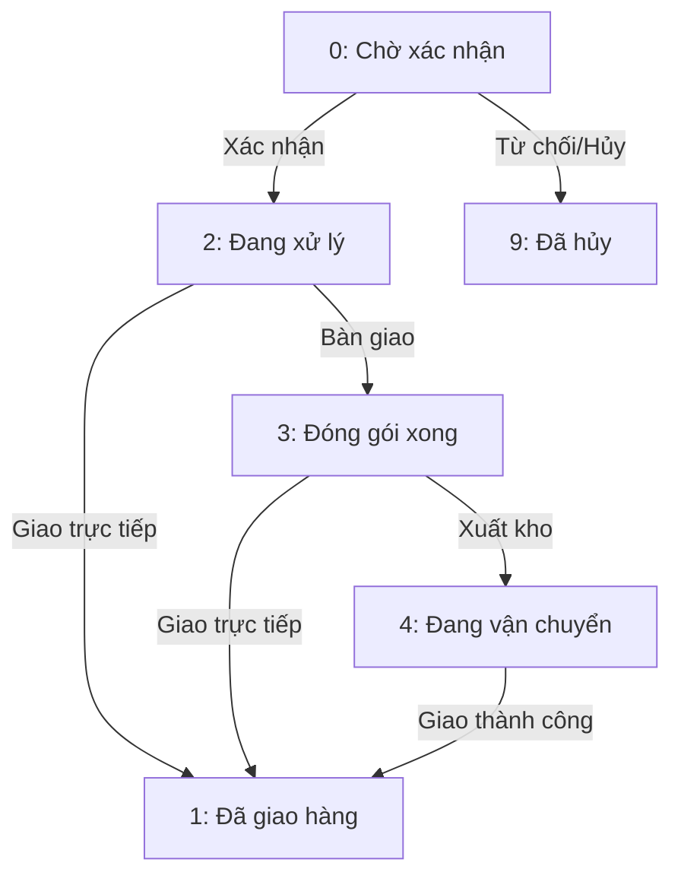
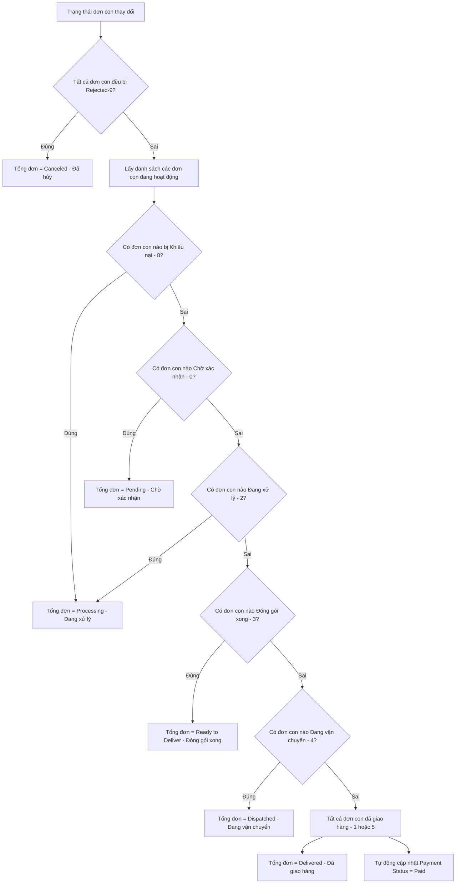

# LUỒNG ĐỒNG BỘ & CẬP NHẬT TRẠNG THÁI ĐƠN HÀNG (ORDER STATUS FLOW)

Tài liệu này hướng dẫn chi tiết về luồng cập nhật trạng thái đơn hàng giữa **Seller (Người bán)** và **Admin (Quản trị viên)**, thuật toán đồng bộ tự động trạng thái đơn hàng chính (Parent Order) và cách hiển thị trực quan cho **Buyer (Người mua)**.

---

## 1. Hệ thống Trạng thái Đơn hàng con (SubOrder Statuses)

Đơn hàng con (`sub_orders`) của từng Shop là đối tượng trực tiếp thay đổi trạng thái trong suốt quá trình xử lý và giao nhận:

| Giá trị | Hằng số Constant | Trạng thái hiển thị | Ý nghĩa nghiệp vụ | Màu sắc giao diện |
|:---:|:---|:---|:---|:---|
| **0** | `SUBORDER_PENDING` | Chờ xác nhận | Đơn hàng con mới được tạo, chờ Shop duyệt. | Xanh dương (`#dbeafe`) |
| **2** | `SUBORDER_PROCESSING` | Đang xử lý | Shop đã xác nhận đơn và đang chuẩn bị hàng. | Vàng cam (`#fef3c7`) |
| **3** | `SUBORDER_READY_TO_PICKUP` | Đóng gói xong | Hàng đã sẵn sàng bàn giao cho đơn vị vận chuyển. | Xanh ngọc (`#cffafe`) |
| **4** | `SUBORDER_DISPATCHED` | Đang vận chuyển | Đơn vị vận chuyển đang đi giao hàng. | Tím nhạt (`#e0e7ff`) |
| **1** | `SUBORDER_DELIVERED` | Đã giao hàng | Khách hàng đã nhận hàng thành công (Hậu kiểm). | Xanh lá (`#d1fae5`) |
| **5** | `SUBORDER_COMPLETED` | Hoàn thành | Đã quyết toán tiền hàng thành công cho ví của Seller. | Xanh lá (`#d1fae5`) |
| **8** | `SUBORDER_DISPUTED` | Khiếu nại | Khách hàng mở khiếu nại về sản phẩm của đơn con này. | Đỏ nhạt (`#fee2e2`) |
| **9** | `SUBORDER_REJECTED` | Đã hủy | Shop từ chối đơn hàng con (Hết hàng, lỗi...). | Hồng đậm (`#fce7f3`) |

---

## 2. Luồng thao tác & Quyền hạn cập nhật trạng thái

### 2.1. Phía Seller (Người bán)
Seller chỉ được phép cập nhật trạng thái đơn hàng con của chính Shop mình quản lý (`seller_id = auth_seller_id`).
Để bảo toàn tính hợp lệ của luồng vận chuyển, hệ thống áp đặt **Quy tắc chuyển đổi trạng thái (Allowed Transitions)** nghiêm ngặt:

* **Hành động từ chối (`Rejected - 9`):** 
  - Hoàn trả lại số lượng tồn kho của các sản phẩm tương ứng trong đơn hàng (`StockLog::restoreStock`).
  - Trừ đi tổng giá trị đơn hàng con bị hủy khỏi tổng tiền đơn hàng chính: `$order->total_amount -= $suborder->total_amount`.
  - Gửi thông báo đến Buyer thông báo mặt hàng bị hủy (`ORDER_ITEM_CANCELED`).
  - Nếu **TẤT CẢ** các đơn hàng con thuộc đơn hàng chính đều bị hủy, đơn chính sẽ tự động chuyển thành **`ORDER_CANCELED` (Đã hủy hoàn toàn)**.

---

### 2.2. Phía Admin (Quản trị viên)
Admin có đặc quyền tối cao:
* **Ghi đè mọi trạng thái:** Admin có thể chuyển đổi đơn hàng con sang bất kỳ trạng thái nào thông qua trang quản trị mà không bị giới hạn bởi quy trình của Seller.
* **Quyết toán đơn hàng (`Status::SUBORDER_COMPLETED - 5`):**
  - Đây là bước đặc biệt quan trọng chỉ Admin có quyền làm.
  - Khi bấm **Quyết toán (Settlement)**:
    1. Hệ thống cộng tiền đơn hàng con vào ví (số dư tài khoản) của Seller bán hàng: `$seller->balance += $suborder->total_amount`.
    2. Ghi nhận nhật ký biến động số dư (`Transaction`) và gửi email thông báo cho Seller.
    3. Lưu vết lịch sử bán hàng (`SellLog`) và cộng dồn số lượng sản phẩm đã bán (`product->sold += quantity`).

---

## 3. Thuật toán Đồng bộ Trạng thái tự động (Parent-Child Sync)

Bất cứ khi nào trạng thái của một đơn hàng con (`sub_orders`) được cập nhật bởi Seller hoặc Admin, hệ thống sẽ tự động chạy thuật toán đồng bộ trạng thái đơn hàng chính (`orders`) theo thứ tự ưu tiên logic sau:

### Chi tiết logic Code trong Model `Order.php`:
Trạng thái hiển thị thực tế của đơn hàng tổng được tính toán thời gian thực (Real-time dynamic attribute) qua hàm `computedStatus()`:
* **Đã hủy (`ORDER_CANCELED`):** Khi giỏ hàng trống hoặc 100% tất cả đơn hàng con bị Shop hủy/từ chối.
* **Đang xử lý (`ORDER_PROCESSING`):** Chỉ cần có ít nhất một đơn con đang bị khiếu nại (`DISPUTED`) hoặc đang xử lý (`PROCESSING`).
* **Đóng gói xong (`ORDER_READY_TO_DELIVER`):** Ít nhất một đơn con sẵn sàng bàn giao (`READY_TO_PICKUP`).
* **Đang vận chuyển (`ORDER_DISPATCHED`):** Ít nhất một đơn con đang trên đường giao hàng (`DISPATCHED`).
* **Đã giao (`ORDER_DELIVERED`):** Tất cả đơn con đều đã giao hàng (`DELIVERED`) hoặc đã quyết toán tiền (`COMPLETED`).

---

## 4. Giao diện hiển thị trực quan cho Người mua (Buyer View)

Khách hàng mua hàng được cung cấp một giao diện minh bạch tại trang **Quản lý đơn hàng cá nhân** để theo dõi chi tiết từng món hàng của mình:

### 4.1. Trạng thái tổng thể (Overall Status)
* Sử dụng thuộc tính động `$order->computed_status_name` để hiển thị trạng thái tổng hợp dễ hiểu (Ví dụ: "Đang vận chuyển", "Chờ xác nhận").
* Hiển thị bảng tóm tắt nhanh số lượng đơn con theo từng trạng thái bằng hàm `$order->getSubOrderStatusSummary()` giúp khách nắm rõ tiến độ (Ví dụ: "1 đơn con đang chuẩn bị, 1 đơn con đang giao").

### 4.2. Trạng thái chi tiết từng Shop (Sub-order Tracking)
* Giao diện liệt kê rõ ràng danh sách các đơn con được phân nhóm riêng biệt theo từng Shop (`@foreach($order->subOrders as $subOrder)`).
* Mỗi Shop hiển thị đầy đủ tên Shop kèm theo một nhãn trạng thái độc lập (`{!! $subOrder->badgeHtml !!}`).
* Khách hàng có thể biết chính xác sản phẩm nào thuộc shop nào đã giao, sản phẩm nào bị shop nào hủy rất rõ ràng, đảm bảo trải nghiệm mua sắm Multi-vendor chuyên nghiệp chuẩn Tiki/Shopee.
